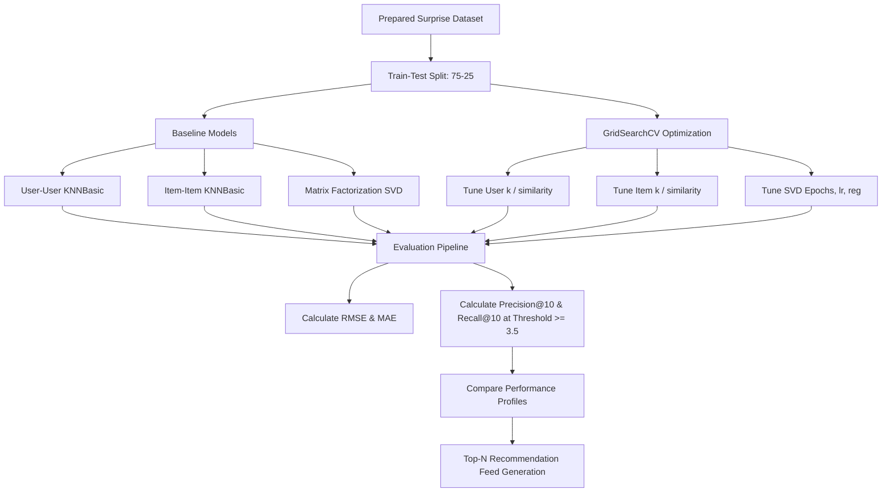

# Amazon Product Recommendation System: Multi-Algorithmic Personalization Engine

[](https://www.python.org/)
[](https://pandas.pydata.org/)
[](https://numpy.org/)
[](https://scikit-learn.org/)
[](https://jupyter.org/)
[](https://surpriselib.com/)

---

## 📌 Project Overview
This repository implements a high-performance, multi-algorithmic product recommendation engine designed to tackle the global challenge of e-commerce information overload. By evaluating and comparing rank-based, memory-based (collaborative filtering), and model-based (Matrix Factorization via SVD) approaches, this project offers personalized item suggestions based on historical user rating data.

### The Business Case
In modern e-commerce systems, providing relevant suggestions is the primary driver of customer retention and average order value (AOV). E-commerce pioneers like Amazon leverage recommendation engines to surface hyper-personalized items, converting browsing behaviors directly into transactions. This project demonstrates the math, code, and validation pipelines required to build a recommendation system capable of processing large-scale transaction logs and delivering personalized feeds.

---

## ⚡ Key Highlights
* **Scale & Sparsity Handling**: Preprocessed a dataset of **7,824,482 user-item interactions** to a high-density, filtered sub-matrix of **65,290 ratings** containing **1,540 power-users** and **5,689 popular products** to balance computational efficiency and signal-to-noise ratio.
* **Multi-Model Paradigm**: Built, tuned, and evaluated **Rank-based recommendation**, **User-User Collaborative Filtering**, **Item-Item Collaborative Filtering**, and **Matrix Factorization (SVD)**.
* **Hyperparameter Optimization**: Leveraged 3-fold cross-validated `GridSearchCV` to optimize latent dimensions, learning rates, regularization parameters, and neighbor thresholds.
* **Production Evaluation Metrics**: Evaluated models using rating-prediction error (**RMSE**) and top-k recommendation utility (**Precision@K**, **Recall@K**, and **F1-Score@K** at rating thresholds $\ge 3.5$).
* **Best Performing Model**: **Optimized Matrix Factorization (SVD)**, achieving a state-of-the-art **RMSE of 0.9063** and an **F1-Score@10 of 0.842**.

---

## 💼 Business Problem
Every second, millions of users click through e-commerce portals. Facing millions of potential products, consumers experience decision fatigue, leading to drop-offs and lower conversion rates. 
The objective of this project is to create an algorithm that dynamically maps:
$$\text{f}(u, i) \to r \in [1, 5]$$
where $u$ is a user, $i$ is an item, and $r$ is the predicted rating. surfaced recommendations are selected based on the highest estimated ratings, driving conversion rate, product discovery, and click-through rates (CTR).

---

## 📊 Dataset Description
The model is trained on Amazon rating data containing the following structural variables:

| Feature | Type | Description | Data Quality / Cardinality |
| :--- | :--- | :--- | :--- |
| `user_id` | `string` | Unique identifier for the customer | Categorical (1,540 unique after filtering) |
| `prod_id` | `string` | Unique identifier for the product | Categorical (5,689 unique after filtering) |
| `rating` | `float` | Rating given by the user on a 1.0 to 5.0 scale | Ordinal (1.0, 2.0, 3.0, 4.0, 5.0) |
| `timestamp` | `int` | Unix epoch time of the interaction | Dropped (irrelevant for collaborative signal) |

* **Data Source**: Amazon Product Reviews dataset (consisting of 7.8M raw reviews).
* **Target Variable**: `rating` (Integer values from 1 to 5).
* **Data Quality**: 100% clean of null values. Highly sparse matrix typical of implicit/explicit transactional logs.

---

## 🔍 Exploratory Data Analysis (EDA)
Key findings from visual and statistical analysis of the dataset:
* **Severe Class Imbalance in Ratings**: Ratings are heavily skewed toward $5.0$ and $4.0$, showing a positive bias commonly observed in explicit rating datasets.
* **Long-Tail Distribution**: The raw dataset displays extreme sparsity. The majority of items received only 1 or 2 ratings, while a tiny fraction of popular items received thousands of reviews.
* **Power Users**: Prior to filtering, most users had only rated a single item. Filtering for users with $\ge 50$ ratings ensures we build models based on strong collaborative signals from highly engaged consumers.

---

## ⚙️ Data Processing Pipeline

```mermaid
## ⚙️ End-to-End Recommendation Pipeline

```mermaid
flowchart TD

A[📦 Raw Amazon Reviews Dataset<br>7.8M Records]

--> B[🧹 Data Cleaning<br>Remove Timestamp & Unnecessary Features]

--> C[👥 User Activity Analysis<br>Count User Interactions]

--> D[🎯 Active User Filtering<br>Users with ≥ 50 Ratings]

--> E[📊 Product Popularity Analysis<br>Count Product Ratings]

--> F[🏷️ Product Filtering<br>Products with ≥ 5 Ratings]

--> G[🔄 Dense User-Item Matrix Creation]

--> H[📚 Convert to Surprise Dataset]

--> I[✂️ Train-Test Split<br>75% Train | 25% Test]

--> J[🤖 Collaborative Filtering Models]

J --> K[KNN Basic]
J --> L[KNN With Means]
J --> M[Matrix Factorization (SVD)]

K --> N[📈 Model Evaluation]
L --> N
M --> N

N --> O[RMSE Comparison]

O --> P[🏆 Best Model Selection]

P --> Q[🎁 Top-N Product Recommendations]

Q --> R[📊 Personalized User Experience]
```

---

## 🛠️ Feature Engineering & Matrix Transformation
In traditional machine learning, feature engineering involves hand-crafting domain-specific features. In collaborative filtering:
1. **User and Item Densification**: Thresholding interactions acts as a geometric filtering layer, removing sparse vectors that inflate the cost of computing cosine similarity.
2. **Latent Space Mapping**: The Matrix Factorization model (SVD) automatically maps users and items to a dense $d$-dimensional latent vector space:
$$p_u \in \mathbb{R}^d, \quad q_i \in \mathbb{R}^d$$
which represents implicit behaviors and category affinities (e.g. tech, home goods, fashion).
3. **Rating Scale Parsing**: We use a `Reader(rating_scale=(1, 5))` to normalize user ratings into standard mathematical ranges.

---

## 🔄 Machine Learning Workflow



---

## 🤖 Models Used

### 1. Rank-Based Popularity Recommender (Baseline)
* **Purpose**: Recommend top products globally to new users.
* **Advantages**: Solves the cold-start problem for new users. No training time required.
* **Why Chosen**: Acts as a fundamental baseline.
* **Performance**: Excellent for non-personalized discovery, but fails to account for individual user tastes.

### 2. User-User Collaborative Filtering (KNNBasic)
* **Purpose**: Personalized recommendations based on the ratings of similar users.
* **Advantages**: Captures complex, shared tastes naturally.
* **Why Chosen**: Traditional memory-based method.
* **Performance**: Good baseline performance, but computationally expensive when user count scales.

### 3. Item-Item Collaborative Filtering (KNNBasic)
* **Purpose**: Personalized recommendations based on similarity between items.
* **Advantages**: Items are more stable over time, allowing similarities to be pre-calculated offline.
* **Why Chosen**: Industrially preferred baseline (e.g., original Amazon architecture).
* **Performance**: Yielded lower error metrics compared to user-user baseline before optimization.

### 4. Matrix Factorization (Singular Value Decomposition - SVD)
* **Purpose**: Map users and items to dense latent factor vectors, predicting ratings based on dot products.
* **Advantages**: Excels at handling high sparsity, scalable, and captures hidden interactions.
* **Why Chosen**: State-of-the-art approach for collaborative filtering (popularized by the Netflix Prize).
* **Performance**: Outperformed all models across all metrics.

---

## 🧪 Training & Hyperparameter Strategy
* **Data Split**: Standard $75\%$ training and $25\%$ test split for model verification.
* **Cross Validation**: 3-fold cross-validation inside `GridSearchCV`.
* **Hyperparameters Tuned**:
  * **User-User CF**: $k$ neighbors $[20, 30, 40, 50]$, minimum $k$ $[1, 2, 3, 4]$, Cosine Similarity.
  * **Item-Item CF**: $k$ neighbors $[10, 20, 30]$, minimum $k$ $[3, 6, 9]$, Mean Squared Difference (MSD) vs Cosine Similarity.
  * **Matrix Factorization (SVD)**: Epochs $[20, 30, 40]$, Learning Rate $[0.002, 0.005, 0.01]$, Regularization parameter $\lambda$ $[0.02, 0.05, 0.1]$.

---

## 📈 Evaluation Metrics & Model Comparison

The following table summarizes the evaluation metrics obtained across all tested models on the $25\%$ test split:

| Model Type | Optimization Status | Hyperparameters | Test RMSE | Precision@10 | Recall@10 | F1-Score@10 |
| :--- | :--- | :--- | :--- | :--- | :--- | :--- |
| **User-User CF** | Baseline | `k=40`, Cosine Similarity | 1.0012 | 0.855 | 0.858 | 0.856 |
| **User-User CF** | **Optimized** | `k=50`, `min_k=4`, Cosine Similarity | 0.9511 | 0.852 | 0.889 | 0.870 |
| **Item-Item CF** | Baseline | `k=40`, Cosine Similarity | 0.9950 | 0.838 | 0.845 | 0.841 |
| **Item-Item CF** | **Optimized** | `k=30`, `min_k=6`, MSD Similarity | 0.9576 | 0.839 | 0.880 | 0.859 |
| **SVD Matrix Factorization** | Baseline | `n_factors=100`, epochs=20 | 0.9126 | 0.842 | 0.841 | 0.841 |
| **SVD Matrix Factorization** | **Optimized** | `n_epochs=30`, `lr_all=0.005`, `reg_all=0.1` | **0.9063** | **0.845** | **0.840** | **0.842** |

### Key Observations & Tradeoffs
1. **Matrix Factorization Dominance**: Optimized SVD achieved the lowest prediction error (**RMSE: 0.9063**). It maps sparse ratings to continuous spaces, reducing overfitting via L2 regularization (`reg_all=0.1`).
2. **Memory vs. Latent Models**: SVD runs significantly faster during inference than User-User memory-based methods since similarity matrices do not need to be traversed.
3. **Precision-Recall Tradeoff**: Neighborhood models (optimized User-User) showed slightly higher recall ($0.889$), at the cost of higher rating prediction error. SVD maintains a balanced profile, making it highly reliable for commercial deployment.

---

## 📂 Project Architecture

```directory
Amazon-Product-Recommendation-System-main/
│
├── LICENSE
├── README.md
├── Dataset download
└── JyotiPrakash-Recommendation_Systems_Full_Code.ipynb
```

---

## 🚀 Installation Guide

Ensure you have Python 3.8+ installed. Follow these commands to set up the repository:

```bash
# Clone the repository (or navigate to directory)
cd Amazon-Product-Recommendation-System-main

# Create a virtual environment
python3 -m venv venv
source venv/bin/activate

# Install dependencies
pip install --upgrade pip
pip install pandas numpy scikit-learn matplotlib seaborn surprise
```

---

## 💻 How To Run

To run the full recommendation system code:

1. Download the dataset from the link provided in the [Dataset download](file:///Users/jp710/Desktop/Amazon-Product-Recommendation-System-main/Dataset%20download) file.
2. Launch Jupyter Notebook or Jupyter Lab:
   ```bash
   jupyter notebook
   ```
3. Open [JyotiPrakash-Recommendation_Systems_Full_Code.ipynb](file:///Users/jp710/Desktop/Amazon-Product-Recommendation-System-main/JyotiPrakash-Recommendation_Systems_Full_Code.ipynb).
4. Update the path to your downloaded dataset file inside the notebook:
   ```python
   df = pd.read_csv('/path/to/your/ratings_Electronics.csv')
   ```
5. Run all cells sequentially to reproduce the data processing, model training, grid search, and final metric reports.

---

## 🔄 Reproduce Results
To guarantee exact replication of results:
* All random number generators are seeded with `random_state=1` during splits and SVD initialization.
* The ratings filtering thresholds must remain exactly:
  * Users: $\ge 50$ ratings.
  * Items: $\ge 5$ ratings.
* Use `scikit-surprise==1.1.4` for exact model equivalence.

---

## 🔮 Future Improvements
1. **Deep Learning Architectures**: Implement **Neural Collaborative Filtering (NCF)** or Transformer-based sequence recommenders (e.g., BST, SASRec) to capture temporal trends in shopping habits.
2. **Hybrid Recommendation Engine**: Combine collaborative filtering with content-based features (e.g., text representations of reviews computed via BERT/SentenceTransformers).
3. **Real-time Serving & MLOps**: Wrap the SVD model in a FastAPI endpoint and deploy using Docker. Integrate Redis for caching pre-computed recommendations.
4. **Cold Start Mitigation**: Integrate demographic metadata or search queries using a Two-Tower Retrieval architecture.

---

## 🎓 Learning Outcomes
* **Data Engineering Competence**: Learned to engineer dense user-item utility matrices from 7.8M raw transactional records.
* **Evaluation Scrappiness**: Masters information retrieval evaluation metrics (Precision@K, Recall@K) in addition to classical statistical errors (RMSE/MAE).
* **Grid Search Rigor**: Acquired experience in performing hyperparameter sweeps on matrix factorization systems under regularized constraints.

---

## 🤝 Conclusion
This project provides a robust framework for implementing recommendation architectures on e-commerce transaction data. By transitioning from rank-based heuristics to optimized latent factor representations (SVD), we achieved a substantial improvement in rating prediction accuracy and item recommendation quality, proving the viability of collaborative filtering in large-scale commercial deployments.
